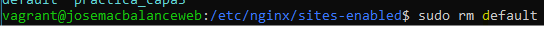
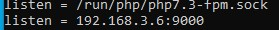
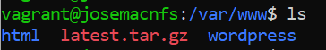
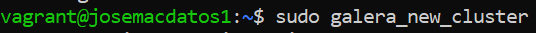

# josemanuel-cano-gonz-lez_capas_alta_disponibilidad
Este repositorio es para la práctica Instalación de Wordpress en arquitectura de 3/4 capas en alta disponibilidad 2º de ASIR módulo Implementación de Aplicaciones Web

## ÍNDICE ## 

- [configuracion_balanceadorweb](#configuración-del-balanceador-web)
- [configuración_serverweb1](#configuración-del-servidor-web-1)
- [configuracion_serverweb2](#configuración-del-servidor-web-2)
- [configuracion_servernfs_y_php_y_descargar_wordpress](#descargar-wordpress-en-los-servidores-web-y-nfs-y-configurar-servidor-nfs-y-motor-php)
- [pasos_previos_a_la_instalación_de_wordpress](#pasos-previos-a-la-instalación-de-wordpress)
- [instalación_wordpress](#instalación-y-personalización-de-wordpress)
- [conclusión](#conclusión)

## INTRODUCCIÓN ##

*En esta práctica la estructura será la siguiente en la 1º capa tendremos al balanceador web que usara nginx en la 2º capa tendremos dos servidores nginx y un servidor nfs junto con el motor de php en la 3º capa tendremos un balanceador de mysql y en la 4º capa tendremos dos servidores mysql ambos y el balanceador usaran mariadb-server y haremos un cluster entre estas 3 máquinas con galera para el balanceador utilizaremos la herramienta haproxy toda esta infraestructura estará montada en vagrant el objetivo de la misma es conseguir instalar y personalizar WordPress en esta estructura mencionada.*

## CONFIGURACIÓN DEL BALANCEADOR WEB ##

*El 1º paso es crear el archivo de configuración en la carpeta #conf.d que está en #/etc/nginc/conf.d lo llamaremos load_balancer.conf y le añadiremos lo siguiente.*

## CONFIGURACIÓN DEL SERVIDOR WEB 1 ##

*El 1º paso en este servidor es hacer una copia del host virtual por defecto default que le vamos a llamar serverweb1 luego habilitaremos el host virtual con un enlace simbólico y eliminaremos el host virtual por defecto llamado default las carpetas serán /etc/nginx/sites-available que es donde está el host virtual por defecto llamado default y la carpeta sites-enable que esta también en /etc/nginx y es donde están habilitados los host virtuales.*

*El 2º paso es editar el sitio virtual serverweb1 que está en /ect/nginx/sites-enable y en la línea que pone add index.php dejajo de esa línea hay una lista del orden que nginx buscara los archivos bien en esa línea detrás de index añadiremos index.php y para conectar el serverweb1 con el motor php que está montado en el servidor nfs más abajo descomentaremos la línea location después la línea include snippets y por ultimo descomentamos la última línea que pone fastcgi_pass y pondremos la ip del servidor nfs:9000.*

## CONFIGURACIÓN DEL SERVIDOR WEB 2 ##

*El 1º paso es lo mismo que en el serverweb1 crear el host virtual mediante una copia del host por defecto y hacer un enlace simbólico para su activación e editar el fichero y añadir index.php a la lista e indicar donde está el motor php.*

## DESCARGAR WORDPRESS EN LOS SERVIDORES WEB Y NFS Y CONFIGURAR SERVIDOR NFS Y MOTOR PHP ##

*El 1º paso es editar el fichero #**/etc/php/7.3/fpm/pool.d/www.conf** y debajo de listen = /run/php/php7.3-fpm.sock añadimos listen= 192.168.3.6:9000 en mi caso y reiniciamos el servicio fpm.*

*El 2º paso es crear el árbol de directorios #**/var/wwww/html** en el servidor nfs y descargar WordPress en los servidores y descomprimirlo en los servidores web 1 y web 2 y nfs.*

*El 3º paso es cambiar en el servidor nfs los permisos sobre la carpeta que vamos a compartir #**/var/www/wordpress** y lo cambiaremos a nobody:nogroup para que los servidores web 1 y 2 puedan crear archivos o cambios en algún fichero y se reflejen esos cambios en el servidor nfs.*

* El 4º paso es editar el fichero /ect/exports para decirle al servidor nfs que carpeta queremos compartir y que clientes pondran montarlas también diremos una serie de directivas como rw permisos de escritura y lectura sync para sincronizar los cambios y no subtree_check es una opción que acepta la manera en el que el sistema maneja las solicitudes de acceso sobre un recurso compartido de nfs exportado pondremos las ip de los servidores web 1 y web 2 y la carpeta que vamos a compartir es #var/www/wordpress como se ve a continuación.*

*El 5º paso es montar las carpetas con el comando mount en los servidores web para eso necesitamos la ip del servidornfs:carpetacompartida carpeta donde se va a montar que es en #/var/wwww/wordpress como vemos a continuación y comprobamos con #df -h que se ha montado correctamente.*

## CONFIGURACIÓN DEL BALANCEAODR DE MYSQL Y GALERA EN LOS SERVIDORES DE DATOS 1 Y 2 ##

*2º paso es para el servicio mysql en los 3 servidores de seguido editamos el fichero #/etc/mysql/mariadb.conf.d/50-server.cnf y poner las cláusulas para hacer un clúster de base de datos en los 3 servidores se llamara en los 3 con el mismo nombre indicaremos la ip en los 3 servidores en el apartado wsrep_cluster-address y en wsrep_node_address pondremos en cada uno su ip propia no la de los otros servidores y el bin address será 0.0.0.0 en todos los servidores.*

*El 2º paso es editar el fichero /etc/haproxy/haproxy.cfg en bind pondremos la ip del servidor balanceador y en server galera-mariadb-1 la ip del balanceador el 2 la ip del server datos 1 y la 3 el server datos 2.*

*El 3º paso es levantar con el comando **#sudo_galera_new_cluster** y comprobamos mediante una sentencia que todo está funcionando.*

*El 4º paso es crear la base de datos y el usuario para WordPress en el balanceador mysql la base de datos se llamra wp_db y el usuario se llamará josema con contraseña josema y el acceso a ese usuario será 192.168.4.% y le daremos permisos al usuario sobre esa base de datos y comprobamos que los servidores nginx acceden a la base de datos.*

## PASOS PREVIOS A LA INSTALACIÓN DE WORDPRESS ##

*Lo primero será cambiar el document root de los servidores web a **#/var/wwww/wordpress***

*Lo segundo será renombrar el fichero wp-simple-config.php a wp-config.php y luego editaremos el fichero para indicar en dbname el nombre de la base de datos que hemos creado db user y db password el usuario y contraseña y el db host la ip del balanceador de mysql lo haremos en el servidor web 1 y se aplicara al servidor web 2 y el servidor nfs debido a que esta compartida la carpeta con nfs y renombraremos el fichero en el servidor nfs.*

## INSTALACIÓN Y PERSONALIZACIÓN DE WORDPRESS ##

*Lo primero que haremos será acceder a la ruta http://192.168.1.112:8001 y lo que nos saldrá es la página de bienvenida de WordPress.*

* Lo siguiente que nos saldrá es configurar WordPress indicando el nombre de la base de datos el usuario y la contraseña de la base de datos el host de la base de datos y el prefijo de las tablas para la base de datos y darle a submit.*

*Ahora nos preguntara el título del sitio el usuario y la contraseña administrador y el email y marcaremos que los navegadores indexen la página.*

*Lo siguiente que se nos mostrara es que se ha creado correctamente y le damos a login in.*

*Ahora nos pregunta nuestras credenciales puestas anteriormente en el usuario y contraseña si es correcto se nos mostrara la página de administración de WordPress.*

*Ahora le daremos al apartado Pages y add new page ahí nos saldrá una pantalla donde personalizaremos la página y le daremos a publicar y copiaremos el enlace y finalmente veremos la página creada y personalizada.*

*Con esto hemos hemos instalado wordpress satisfactoriamente en las 4 capas de servidores.*

## CONCLUSIÓN ##

*La parte mas importante de está práctica son los balanceadores si estos no funcionan nada en la práctica lo hara otra parte mas importante es el servidor nfs con el motor php si los servidores web no se conectan al motor php ni el nfs funciona el servidor dara error 502 tambien montar 4 capas para dar mas seguridad a nuesttra infraestructura.*

**Practica realizada por José Manuel Cano González**